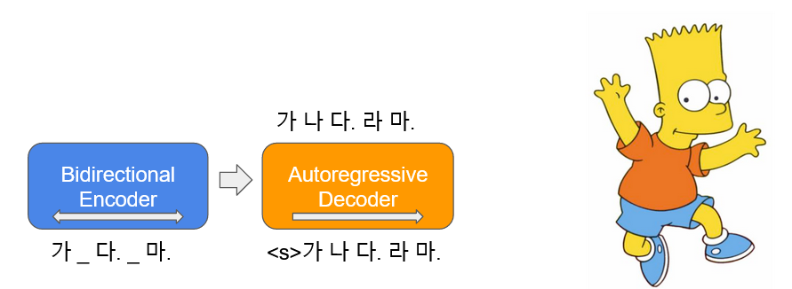

<!-- @import "[TOC]" {cmd="toc" depthFrom=1 depthTo=6 orderedList=false} -->

<!-- code_chunk_output -->

- [🤣 KoBART](#kobart)
  - [How to install](#how-to-install)
  - [Data](#data)
  - [Tokenizer](#tokenizer)
  - [Model](#model)
    - [Performances](#performances)
      - [Classification or Regression](#classification-or-regression)
      - [Summarization](#summarization)
  - [Demos](#demos)
  - [Examples](#examples)
  - [Contacts](#contacts)
  - [License](#license)

<!-- /code_chunk_output -->


# 🤣 KoBART

[**BART**](https://arxiv.org/pdf/1910.13461.pdf)(**B**idirectional and **A**uto-**R**egressive **T**ransformers)는 입력 텍스트 일부에 노이즈를 추가하여 이를 다시 원문으로 복구하는 `autoencoder`의 형태로 학습이 됩니다. 한국어 BART(이하 **KoBART**) 는 논문에서 사용된 `Text Infilling` 노이즈 함수를 사용하여 **40GB** 이상의 한국어 텍스트에 대해서 학습한 한국어 `encoder-decoder` 언어 모델입니다. 이를 통해 도출된 `KoBART-base`를 배포합니다.




## How to install

```
git clone https://github.com/SKT-AI/KoBART.git
cd KoBART
pip install -r requirements.txt
pip install .
```

## Data

| Data  | # of Sentences |
|-------|---------------:|
| Korean Wiki |     5M   |  
| Other corpus |  0.27B    | 

한국어 위키 백과 이외, 뉴스, 책, [모두의 말뭉치 (대화, 뉴스, ...)](https://corpus.korean.go.kr/), [청와대 국민청원](https://github.com/akngs/petitions) 등의 다양한 데이터가 모델 학습에 사용되었습니다.

## Tokenizer

[`tokenizers`](https://github.com/huggingface/tokenizers) 패키지의 `Character BPE tokenizer`로 학습되었습니다. 

`vocab` 사이즈는 30,000 이며 대화에 자주 쓰이는 아래와 같은 이모티콘, 이모지 등을 추가하여 해당 토큰의 인식 능력을 올렸습니다. 
> 😀, 😁, 😆, 😅, 🤣, .. , `:-)`, `:)`, `-)`, `(-:`...

또한 `<unused0>` ~ `<unused99>`등의 미사용 토큰을 정의해 필요한 `subtasks`에 따라 자유롭게 정의해 사용할 수 있게 했습니다.


```python
>>> from kobart import get_kobart_tokenizer
>>> kobart_tokenizer = get_kobart_tokenizer()
>>> kobart_tokenizer.tokenize("안녕하세요. 한국어 BART 입니다.🤣:)l^o")
['▁안녕하', '세요.', '▁한국어', '▁B', 'A', 'R', 'T', '▁입', '니다.', '🤣', ':)', 'l^o']
```

## Model

| Model       |  # of params |   Type   | # of layers  | # of heads | ffn_dim | hidden_dims | 
|--------------|:----:|:-------:|--------:|--------:|--------:|--------------:|
| `KoBART-base` |  124M  |  Encoder |   6     | 16      | 3072    | 768 | 
|               |        | Decoder |   6     | 16      | 3072    | 768 |


```python
>>> from transformers import BartModel
>>> from kobart import get_pytorch_kobart_model, get_kobart_tokenizer
>>> kobart_tokenizer = get_kobart_tokenizer()
>>> model = BartModel.from_pretrained(get_pytorch_kobart_model())
>>> inputs = kobart_tokenizer(['안녕하세요.'], return_tensors='pt')
>>> model(inputs['input_ids'])
Seq2SeqModelOutput(last_hidden_state=tensor([[[-0.4488, -4.3651,  3.2349,  ...,  5.8916,  4.0497,  3.5468],
         [-0.4096, -4.6106,  2.7189,  ...,  6.1745,  2.9832,  3.0930]]],
       grad_fn=<TransposeBackward0>), past_key_values=None, decoder_hidden_states=None, decoder_attentions=None, cross_attentions=None, encoder_last_hidden_state=tensor([[[ 0.4624, -0.2475,  0.0902,  ...,  0.1127,  0.6529,  0.2203],
         [ 0.4538, -0.2948,  0.2556,  ..., -0.0442,  0.6858,  0.4372]]],
       grad_fn=<TransposeBackward0>), encoder_hidden_states=None, encoder_attentions=None)
```

### Performances

#### Classification or Regression

|   |  [NSMC](https://github.com/e9t/nsmc)(acc)  | [KorSTS](https://github.com/kakaobrain/KorNLUDatasets)(spearman) | [Question Pair](https://github.com/aisolab/nlp_classification/tree/master/BERT_pairwise_text_classification/qpair)(acc) | 
|---|---|---|---|
| **KoBART-base**  | 90.07  | 81.31  | 93.80  |

#### Summarization

*업데이트 예정*

## Demos

- <a href="http://20.194.43.11:7874/" target="_blank">요약 데모</a>

<table><tr><td>
  <center></center>
</td></tr></table>

*위 예시는 [ZDNET 기사](https://zdnet.co.kr/view/?no=20201125093328)를 요약한 결과임*

## Examples

- [KoBART ChitChatBot](https://github.com/haven-jeon/KoBART-chatbot)

*KoBART 사용한 흥미로운 예제가 있다면 PR주세요!*

## Contacts

`KoBART` 관련 이슈는 [이곳](https://github.com/SKT-AI/KoBART/issues)에 올려주세요.

## License

`KoBART`는 `modified MIT` 라이선스 하에 공개되어 있습니다. 모델 및 코드를 사용할 경우 라이선스 내용을 준수해주세요. 라이선스 전문은 `LICENSE` 파일에서 확인하실 수 있습니다.
